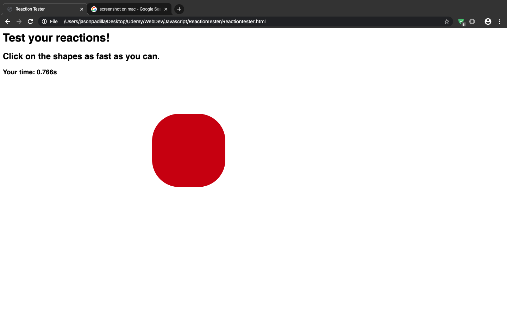
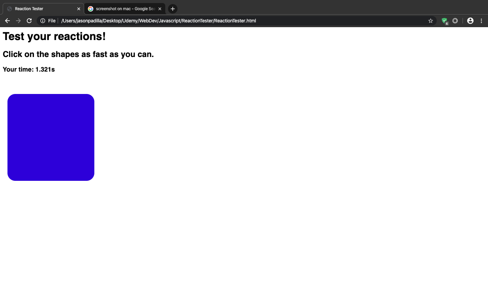

# Reaction Tester
 This is a webpage I created while learning how to develop websites from a Udemy course. The webpage tests user's reaction 
 time by allowing them to click on a random shape that appears on the screen and then displaying how long it took for them 
 to click on the shape. A new shape will be generated at a random time bewteen 0 - 2 seconds after the previous shape has 
 been clicked. The new shape will have randomized attributes such as its X and Y position, Width size, Radius percentage, 
 and Color.
 
# What I learned
  * Put in practice my new Javascript skills
  * Modify style attributes through Javascript
  * Use of functions in Javascript
  * Use of Math.random(), setTimeout() and Date().getTime() methods
  
# Screenshots

